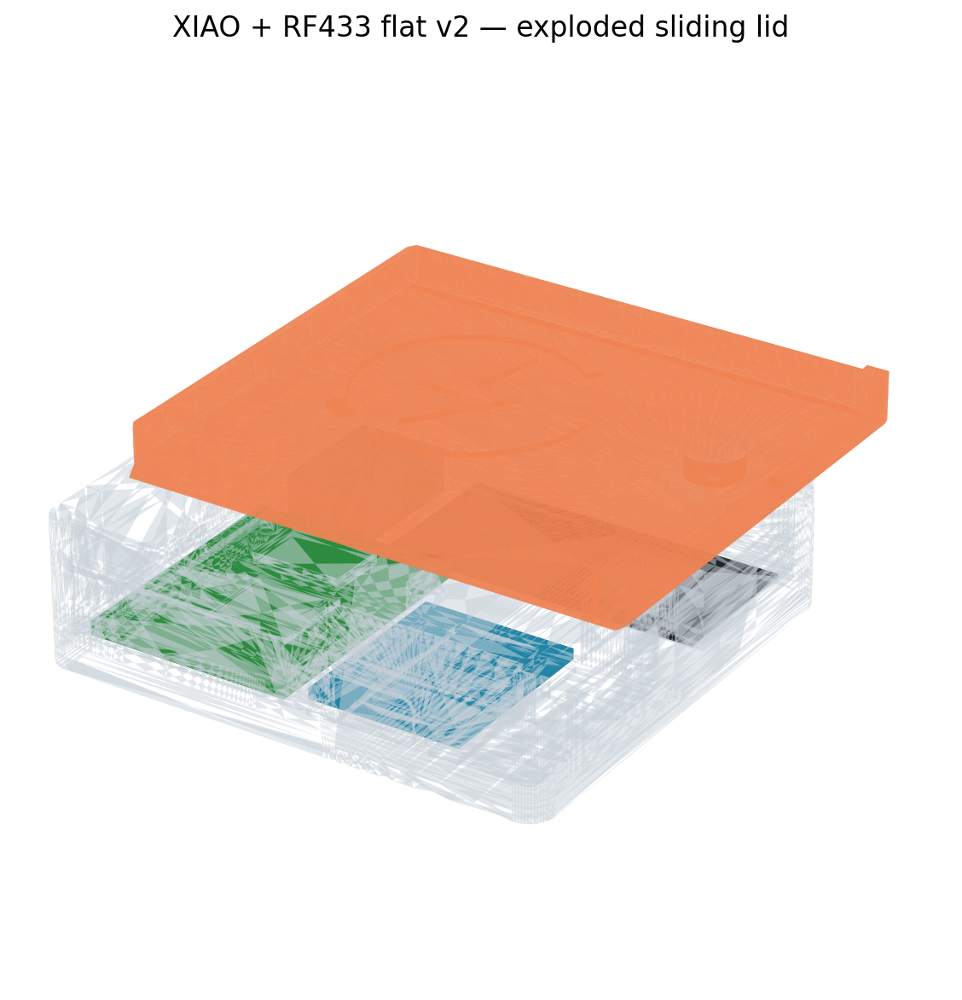

# XIAO ESP32-S3 + RF433 Enclosure

Print this compact enclosure for a **Seeed Studio XIAO ESP32-S3**, an **Open-Smart RF433 transmitter**, and the supplied flat Wi-Fi antenna.

The XIAO and RF433 are positioned side by side. The RF433 sits directly on the enclosure floor, while the antenna lies flat behind the XIAO. The sliding lid is secured with an M3 screw and is supplied with or without an engraved OpenShock icon.

## Files

| File | Purpose |
|---|---|
| `xiao-s3-rf433-body.stl` | Ready-to-print enclosure body |
| `xiao-s3-rf433-lid.stl` | Sliding lid with engraved OpenShock icon |
| `xiao-s3-rf433-lid-nologo.stl` | Sliding lid without a logo |
| `xiao-s3-rf433-case.scad` | Parametric design source |
| `xiao-s3-rf433-preview.png` | Assembly preview |
| `OpenShock-Icon.svg` | Source reference for the lid icon |

## Main dimensions

| Part | Dimension |
|---|---:|
| Overall enclosure | **60.0 × 55.0 × 16.6 mm** |
| Internal floor area | 56.0 × 51.0 mm |
| Wall thickness | 2.0 mm |
| Floor thickness | 3.0 mm |
| Lid thickness | 4.0 mm |
| Sliding clearance | 0.30 mm per sliding face |
| Lid rails | 1.20 mm thick × 1.20 mm deep |
| USB-C opening | 10.0 × 4.8 mm |
| USB-C outer flare | 11.0 × 5.8 mm |

The design uses a nominal XIAO PCB size of **21.0 × 17.8 mm**. The RF433 PCB is **30.0 × 24.0 mm** and is rotated with its 90-degree header facing the rear.

Measure your components before printing. Boards sold under the same general name may use different PCB dimensions, mounting holes or connector positions.

## Internal fit

- XIAO PCB underside: **Z = 4.0 mm**.
- RF433 PCB underside: **Z = 3.0 mm**, directly on the floor.
- Clearance between the RF433 and XIAO: **3.0 mm**.
- Clearance above the nominal XIAO component envelope: approximately **4.14 mm**.
- Clearance above the conservative RF433 component envelope: approximately **2.60 mm**.
- Rear Dupont connector area: **10.5 × 18 × 5 mm**.
- Antenna area: **37.4 × 17.5 mm**, with 1.0 mm clearance from the rear wall.

### RF433 mounting

- The PCB lies directly on the 3.0 mm enclosure floor.
- Two low tapered locating pins position the board without creating a snap-fit.
- The straight pin diameter is **1.55 mm** for measured PCB holes of approximately 2.30 mm.
- Four side guides use **0.20 mm** clearance around the PCB.
- The side guides have a vertical PCB face, a 0.60 mm flat top and a support-free outer slope.
- A central **10 × 10 mm** pocket provides space for a small glue dot.
- The header solder joints have **1.50 mm** local clearance below them.
- At least **1.50 mm** of closed floor remains below the header relief.

The locating pins and guides determine the position. The adhesive prevents the PCB from lifting out of the enclosure.

### XIAO mounting

- Four broad pads position the XIAO PCB at **Z = 4.0 mm**.
- Two side guides use **0.20 mm** clearance and lightly retain the PCB.
- A central **10 × 10 mm** pocket provides **1.75 mm** clearance for a small glue dot.
- Two 3.2 mm-wide channels provide **1.80 mm** clearance below the GPIO solder rows.
- The centre of the USB-C opening is positioned at **Z = 6.66 mm**.

Use only small amounts of adhesive. Do not fill the GPIO or RF433 header reliefs with glue.

## Lid and M3 lock

Use the following hardware:

- 1 × **M3 × 6 mm DIN 7985** pan-head screw.
- 1 × **M3 DIN 934** hex nut.

The lock uses these dimensions:

| Feature | Dimension |
|---|---:|
| Hex nut pocket | 5.9 mm across flats × 2.55 mm deep |
| Screw hole | Ø3.5 mm |
| Recessed screw-head pocket | Ø6.2 × 2.6 mm |
| Remaining material below recess | 1.4 mm |

The nut pocket is built into a solid block connected to the right enclosure wall. Only the hex pocket and screw channel are removed from this block. The block remains 0.30 mm below the closed lid.

Both outer corners of the lid end bar follow the enclosure's R3 corner radius. The lid remains clear of the body at the closed position and throughout the complete sliding path.

## Lid variants

### Lid with logo

Use `xiao-s3-rf433-lid.stl` for the engraved OpenShock version.

- Icon size: **28 mm**.
- Engraving depth: **0.60 mm**.
- Remaining solid lid thickness: at least **3.40 mm**.
- The engraving does not intersect the screw recess, rails or end bar.
- The icon orientation is corrected for the installed lid position.

### Lid without logo

Use `xiao-s3-rf433-lid-nologo.stl` for a plain top surface. The fit, rails, screw recess and outer dimensions are identical to the logo version.

Print either lid with its broad outside face on the build plate and the rails facing upward. The recessed logo opens from the first layer and requires no support.

## Print guidance

The enclosure has been successfully printed in multiple **PLA and PETG** filaments.

| Setting | Starting point |
|---|---:|
| Nozzle | 0.4 mm |
| Layer height | 0.20 mm |
| Walls | 4 |
| Top layers | 4, or according to preference |
| Bottom layers | 4, or according to preference |
| Infill | 15–20% gyroid |
| Supports | **Off** |

Use a calibrated profile for the selected printer and filament. Set temperature, cooling and speed according to the filament manufacturer's recommended range.

### Orientation

1. Print `xiao-s3-rf433-body.stl` with the 3.0 mm floor on the build plate.
2. Print the selected lid with its broad outside face on the build plate.
3. Keep the lid rails facing upward.
4. Disable supports for both parts.
5. Check the sliced preview around the USB-C opening, rails, locating pins and recessed M3 screw hole.

## Assembly

1. Complete and test all soldering before applying adhesive.
2. Place the RF433 with its 90-degree header facing the rear.
3. Check that both locating pins enter the PCB holes without force.
4. Confirm that the RF433 lies flat on the enclosure floor.
5. Apply a small glue dot through the central RF433 pocket.
6. Place the XIAO with its USB-C connector aligned to the front opening.
7. Confirm that its solder joints and wires remain inside the relief channels.
8. Apply a small glue dot through the central XIAO pocket.
9. Attach the Wi-Fi antenna flat in the rear antenna area.
10. Connect and route the wiring without applying pressure to the lid or antenna.
11. Insert the M3 nut from above into the internal nut pocket.
12. Slide the selected lid fully closed.
13. Install the M3 × 6 mm screw.

Tighten the screw only until the lid can no longer slide. The screw locks the lid; it does not need to clamp the enclosure together.

## Validation

The released STL files were exported from the parametric geometry and checked before release:

- One closed, watertight component per STL.
- No open, duplicate or overused mesh edges.
- Closed layer contours around the USB-C opening and recessed M3 screw hole.
- No body/lid collision at 0, 10, 30 or 55 mm of lid travel.
- The final enclosure was physically printed, assembled and fit-tested.

## AI notice

This project was developed with assistance from AI. AI was used to help translate design requirements into parametric geometry, prepare STL exports, perform scripted mesh checks and draft documentation.

The design direction, component selection, measurements, revision decisions and physical fit testing were provided or reviewed by the project owner. The final enclosure was physically printed and verified, but the AI-assisted files may still contain errors or behave differently with other printers, materials or component revisions. Review the source, inspect the sliced preview and verify all clearances before use.

## Logo notice

The OpenShock name and icon belong to their respective owner(s). Their inclusion identifies the intended project compatibility and does not imply ownership of the OpenShock branding. Check the applicable branding terms before redistributing modified logo assets.
